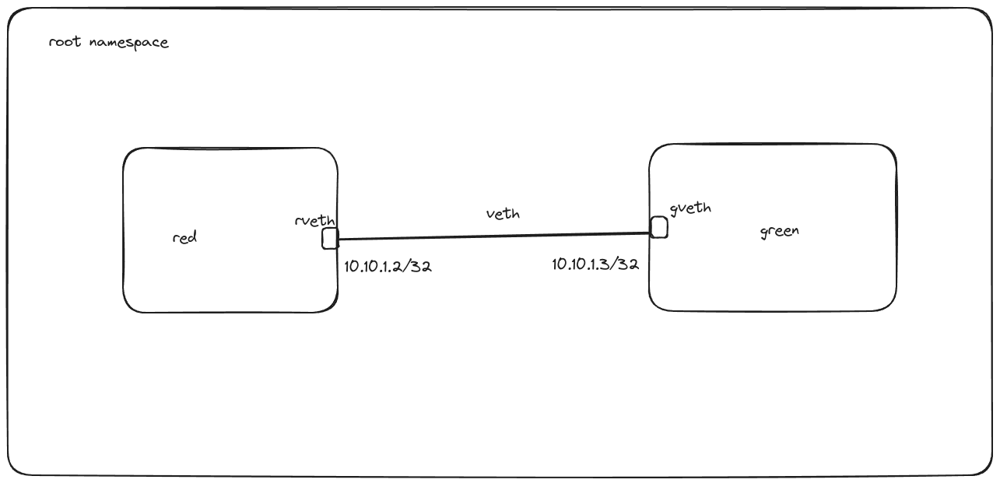

# Network Namespace

## Create two namespace
```bash
sudo ip netns add red
sudo ip netns add green
```
## List of namespace
```bash
sudo ip netns list
```
## To Identify the netns
```
sudo ip netns exec red bash
ip netns identify
```
## Navigate to Namespace
```bash
sudo ip netns exec red bash
```
Here after **exec** we put the name of the namespace

## Create a virtual ethernet cable (veth)
This virtual ether net cable we will use to connect to namespace
```
sudo ip link add rveth type veth peer name gveth
```
Here **rveth** is one connector of virtual ethernet cable and **gveth** is another connector of virtual ethernet cable

## list the connector
```bash
sudo ip link list
```
We can see the both connector i.e **rveth** and **gveth** from namespace because it still not associated to any nameaspace. When we add those to the namesapce we can't see that from host namespace

## Assign two virtual connector to namespaces
```bash
sudo ip link set rveth netns red
sudo ip link set gveth netns green
```

Now we assign the connector to the namespaces

We can see the interface from the namespaces now, not from host namespaces
To check the interface, we need to navigate to namespaces and run **ip addr**

```bash
sudo ip netns exec red bash
ip addr
```
you will see two interface, **lo** i.e loop back and **rveth** and both are in **DOWN** state

Now we need to turn it ON

## Turn on the interfaces
```bash
sudo ip netns exec red ip link set dev lo up
sudo ip netns exec red ip link set dev rveth up
sudo ip netns exec green ip link set dev lo up
sudo ip netns exec green ip link set dev gveth up
```

## Assign IP address to interface
Assign IP address to newly created interface i.e rveth and gveth
```bash
sudo ip netns exec red bash
ip addr add 10.10.1.2/32 dev rveth

sudo ip netns exec green bash
ip addr add 10.10.1.3/32 dev gveth
```

Now if we ping from one namespace to another namespace it will not work. because we have nothing in route table in both namespace
if we run 
``` 
route
```
we will get empty output in both namespace

Now, we need to add routing information

## Add routing information
```bash
sudo ip netns exec red bash
ip route add 10.10.1.3/32 dev rveth

sudo ip netns exec green bash
ip route add 10.10.1.2/32 dev gveth
```

Now we can communicate between two namespaces

