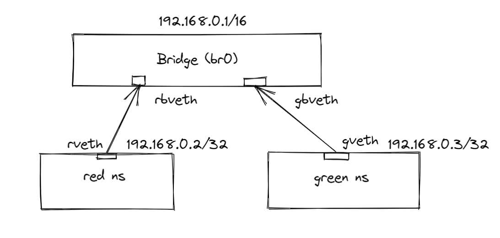

# Network Namespace with bridge network
Here we will create two network namespace and connect to the bridge network to communicate with each other

## Diagram


## Create two network namespace
```
sudo ip netns add red
sudo ip netns add green
```
To list the namespace
```
sudo ip netns list
```

## Create a bridge network
```
sudo ip link add br0 type bridge
sudo ip link set dev br0 up
sudo ip addr add 192.168.0.1/16 dev br0
```

## Create Virtual Ethernet Cable (veth)
```
sudo ip link add rveth type veth peer name rbveth
sudo ip link add gveth type veth peer name gbveth
```

## Add two connector to two namespaces
```
sudo ip link set rveth netns red
sudo ip link set gveth netns green
```

## Turn on the connector
```
sudo ip netns exec red ip link set dev lo up
sudo ip netns exec red ip link set dev rveth up
sudo ip netns exec green ip link set dev lo up
sudo ip netns exec green ip link set gveth up
```

## Create two port in Bridge network
```
sudo ip link set dev rbveth master br0
sudo ip link set dev gbveth master br0
```

## Turn on the bridge connector
```
sudo ip link set dev rbveth up
sudo ip link set dev gbveth up
```

## Add Ip to Interfaces of Namespaces
```
sudo ip netns exec red bash
ip addr add 192.168.0.2/32 dev rveth

sudo ip netns exec green bash
ip addr add 192.168.0.3/32 dev gveth
```

## Add the routing information via bridge
```
sudo ip netns exec red ip route add default via 192.168.0.2 dev rveth
sudo ip netns exec green ip route add default via 192.168.0.3 dev gveth
```

Now we can ping green namespace from red using green namespace ip address and vice-versa

```
sudo ip netns exec red ping 192.168.0.3
sudo ip netns exec green ping 192.168.0.2
```


## Add Iptables rule to access the internet
Now, we want to access the internet from any namespace
First, We need to enable **ip_forward** value to **1**
```
sudo -i
sysctl -a | grep ip_forward
sysctl -w net.ipv4.ip_forward=1
sysctl -p
```

### Flush nat rules and masquerade
```
sudo iptables -t nat -F
sudo iptables -t nat -A POSTROUTING -s 192.168.0.1/16 ! -o br0 -j MASQUERADE
```